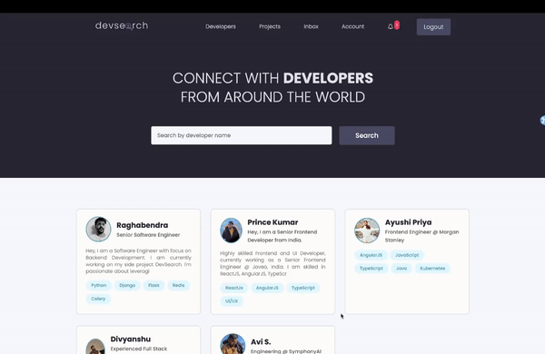

---

## 🛠️ Backend-End

## 🖼️ Front-End

## 📋 Table of Contents

1. 🤔 [About](#about)
2. ✎ [System Design](#system-design)
3.  🍁 [Features](#features)
4. 🔨 [Installation](#installation)
5. 🚀 [Getting Started](#getting-started)
6. 👨‍💻 [Build](#build-the-app)
7. ©️ [License](#license)
8. ❤️ [Contributors](#contributors)

## <a name="license">©️ License</a>

This project is licensed under the [MIT License](http://opensource.org/licenses/MIT).

## <a name="contributors">❤️ Contributors</a>

There is no contributor yet. Want to be the first ?